# 3Blue1Brown Essence of Linear Algebra Lecture Notes

- [3Blue1Brown Essence of Linear Algebra Lecture Notes](#3blue1brown-essence-of-linear-algebra-lecture-notes)
    - [3](#3)
    - [4](#4)
    - [5](#5)
    - [6](#6)
        - [Right Hand Axes](#right-hand-axes)
        - [Determinant Calculation](#determinant-calculation)
    - [7 Inverse Matrices, Column Space and Null Space uQhTuRlWMxw](#7-inverse-matrices-column-space-and-null-space-uqhturlwmxw)
    - [8 Nonsquare Matrices as Transformations Between Dimensions](#8-nonsquare-matrices-as-transformations-between-dimensions)
    - [9 Dot Products and Duality](#9-dot-products-and-duality)

Playlist: <https://www.youtube.com/playlist?list=PLZHQObOWTQDPD3MizzM2xVFitgF8hE_ab>

## 3

Source: <https://www.youtube.com/watch?v=kYB8IZa5AuE>

**Linear transformation** in layman's terms: after a linear transformation, lines remain lines, and the origin stays fixed.
In other words, keep grid lines parallel and evenly spaced.

Linear transformation in formulae:

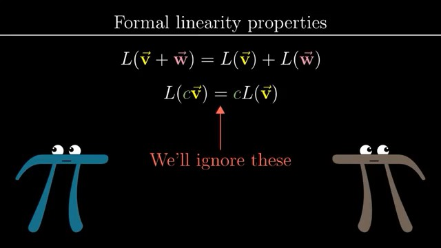

## 4

**Composition** of multiple transformations `A @ B @ P`:

- Matrix multiplication of those individual transformation matrices
- The transformation of the rightward matrix `B` get applied first

## 5

Again, 3D transformation matrix's columns: new locations of the new unit vectors.

## 6

**Determinant** of a transformation: area (2D)/volume (3D) scaling factor.

Area scaling factor can be calculated by using square (0, 0, 1, 1):

- All squares have the same scaling factor
- Any area can be *approximated* by small enough squares

Values:

- 0 determinant ->
    - **reduce dimension**
    - Columns are linearly dependent
- Negative determinant -> "invert"/"flip" space

`det(AB) = det(A)det(B)`

### Right Hand Axes

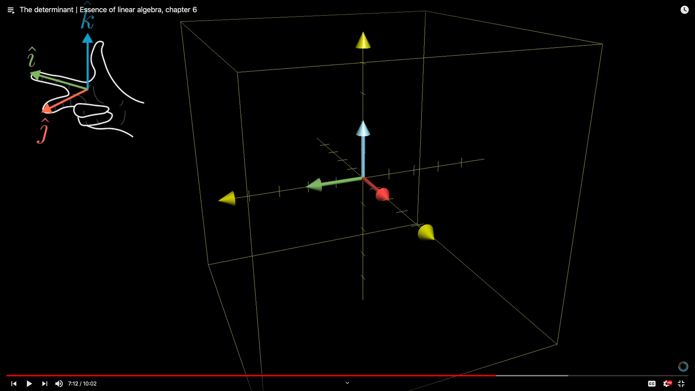

Can no longer use right hand axes after the transformation: determinant < 0

### Determinant Calculation

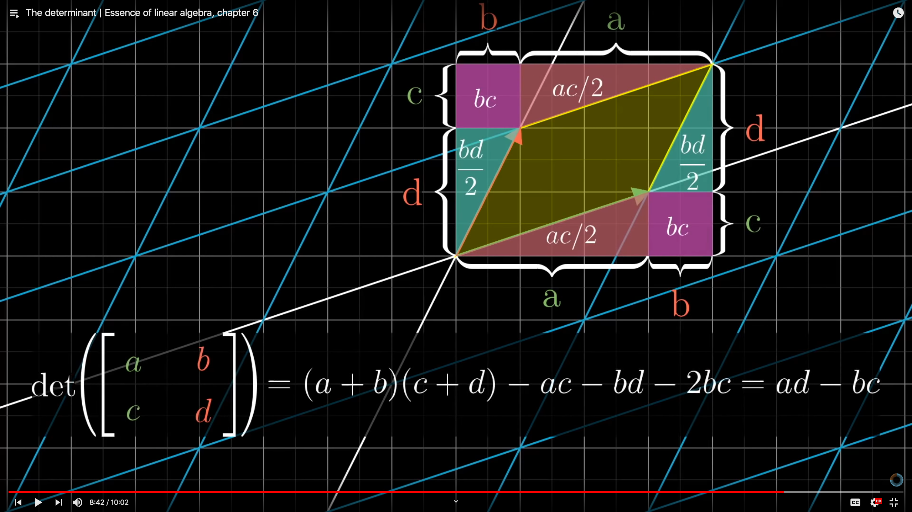

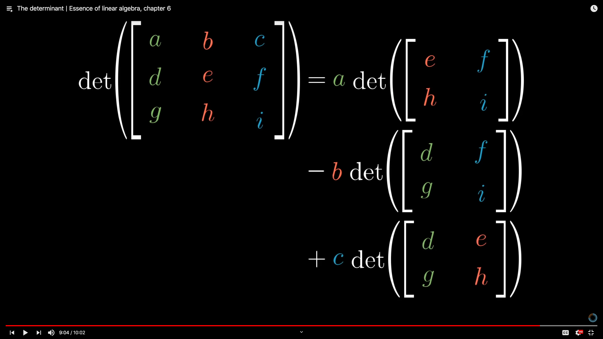

## 7 Inverse Matrices, Column Space and Null Space uQhTuRlWMxw

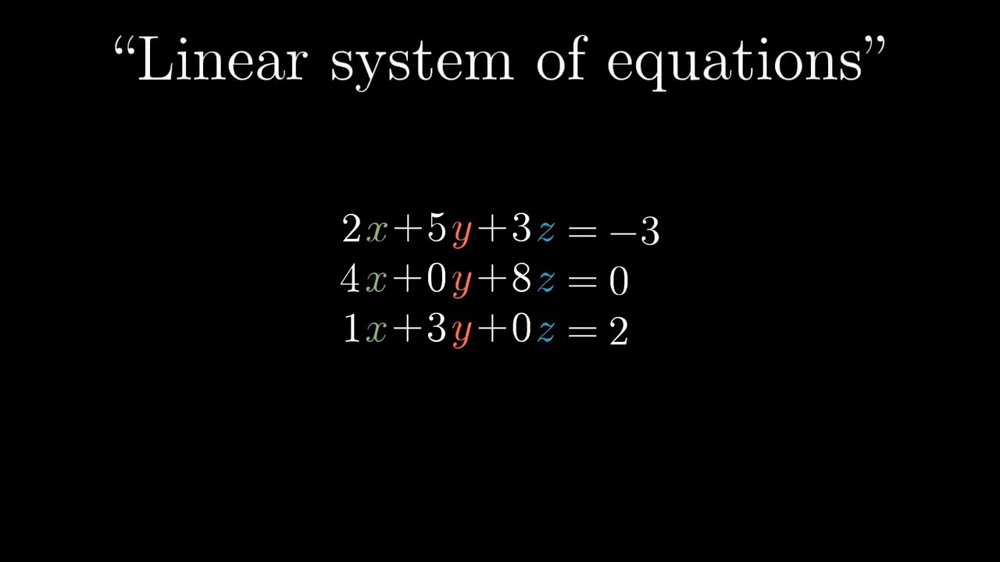

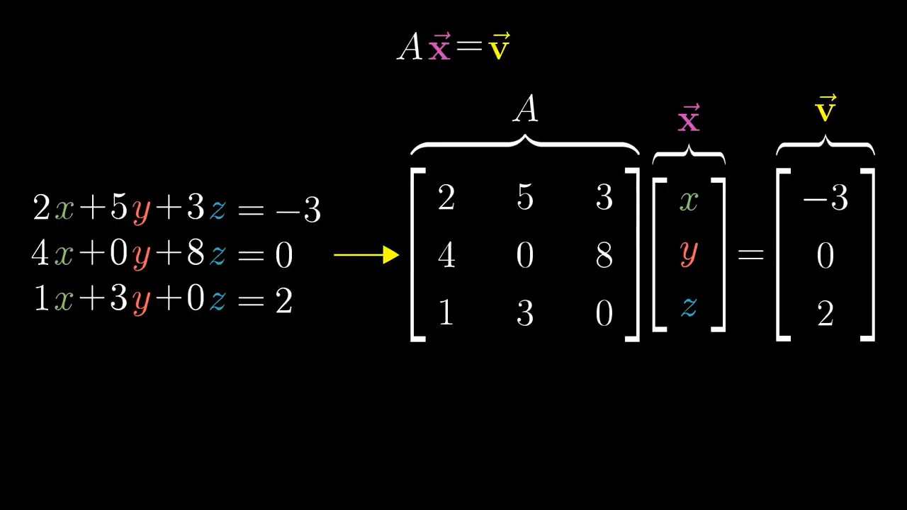

Identity transformation: `inverse(A) @ A == I`

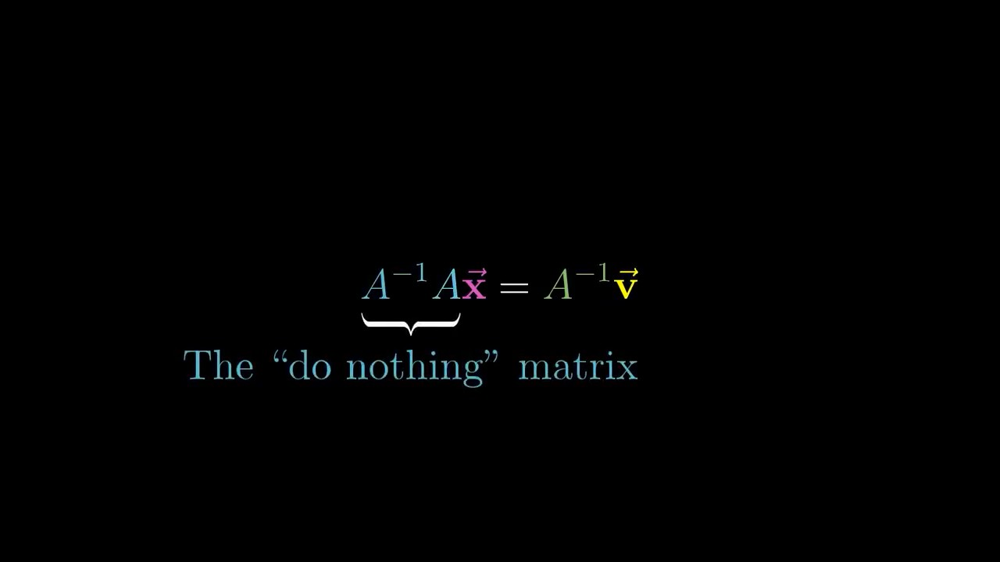

`det(A) == 0`: Not inversible.
Solutions don't exist if the 2 equations contradict:

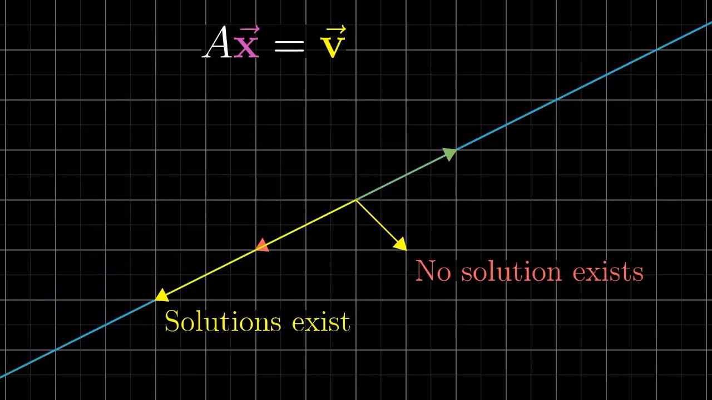

Rank: New dimensionality.
"full rank"

**Null space**/**kernel**: The set of vectors that lands on the origin after the transformation.
Describes solutions of `A @ x == [[0], [0]]`.

## 8 Nonsquare Matrices as Transformations Between Dimensions

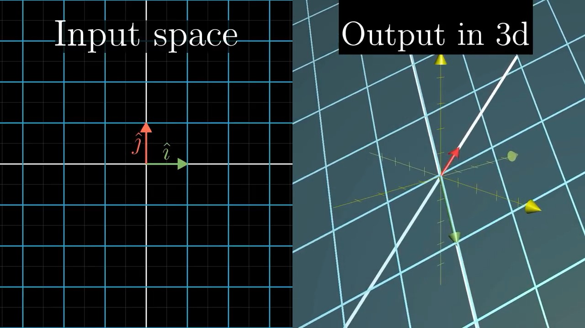

Example: 2D vector to 3D vector

Column space: a plane in 3D space

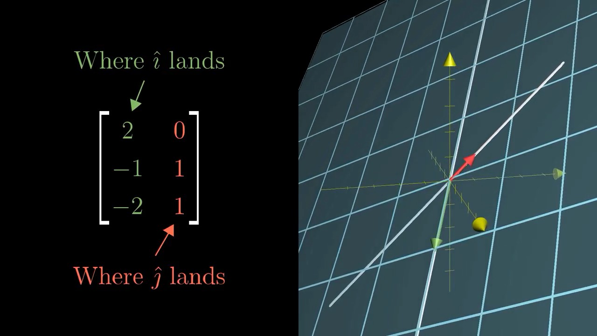

## 9 Dot Products and Duality

Dot product calculation using numbers:

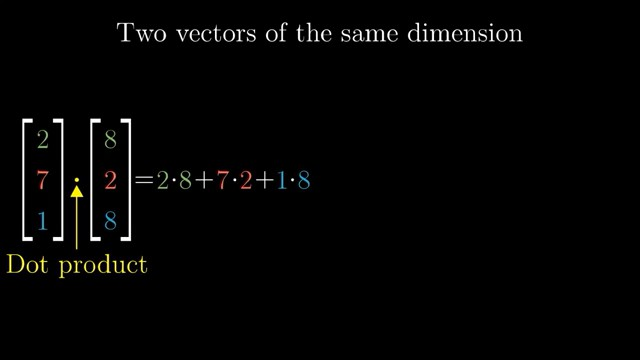

Dot product calculation using projection: `len(w's projection on v) * len(v)`

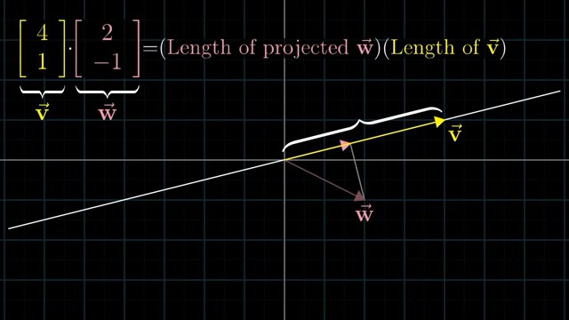

- If `w`'s projection is opposite to `v`, the dot product is negative
- Perpendicular vector: dot product is 0

Dot product usage: check if 2 vectors point in roughly the same direction.

`v . w == w . v`

Consider one of the vectors as a transformation matrix:

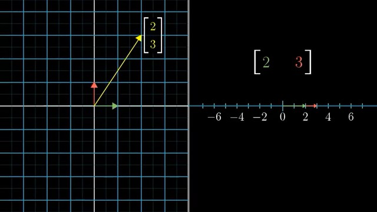

**Duality**: natural by surprising correspondence between 2 things.
