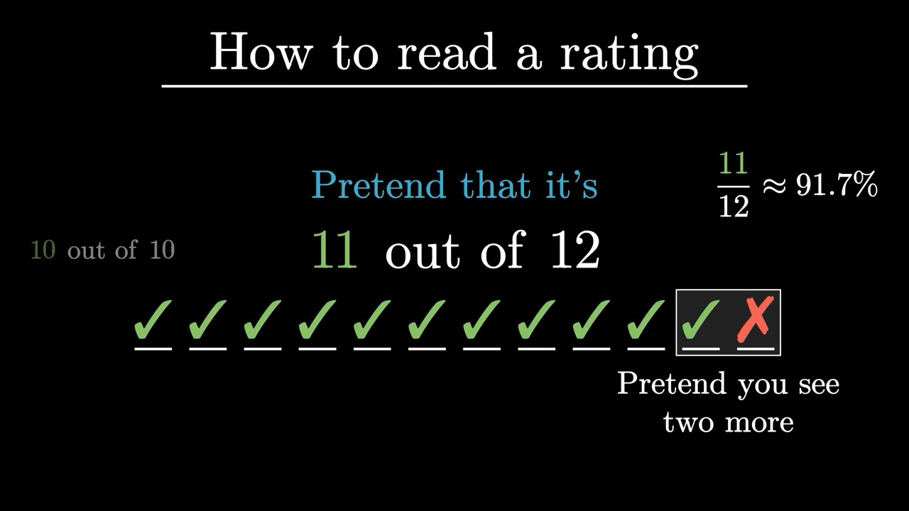
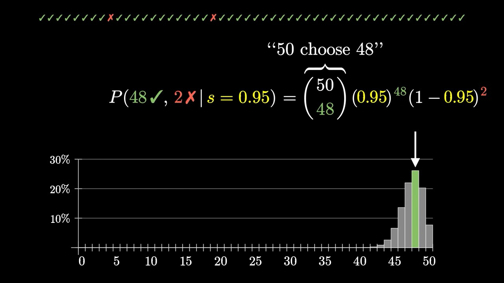

# Probabilities of Probabilities Lecture Notes

Playlist: <https://www.youtube.com/playlist?list=PLZHQObOWTQDOjmo3Y6ADm0ScWAlEXf-fp>

## 1 Binomial Distributions

Laplace's Rule of Succession:
Read Amazon ratings: pretend that you see 2 more ratings, a positive and a negative.

Binomial distribution "totals" formula:

